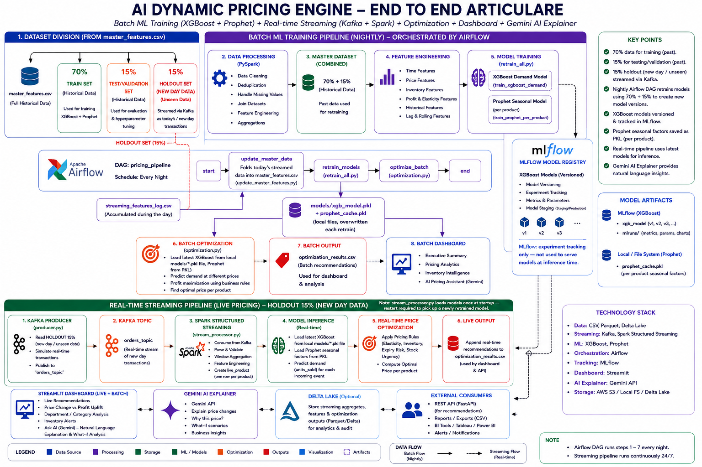

<<<<<<< HEAD
# Dynamic Pricing Engine

An end-to-end ML pricing pipeline: XGBoost + Prophet demand forecasting, price
optimization, real-time Kafka/Spark streaming, nightly Airflow retraining, MLflow
experiment tracking, and a Streamlit dashboard.


## Architecture



Kafka replays genuinely unseen historical data (`streaming_holdout.csv`) rather
than data the model already trained on, so the "real-time" predictions are on
real held-out data. Streamed events get logged and folded back into
`master_features.csv` before each nightly retrain, so retraining actually
incorporates new data instead of training on the same file every time.

Two things the diagram simplifies, worth stating explicitly:
- **MLflow is used for experiment tracking only** — it is not queried at
  inference time. Both `optimization.py` and `stream_processor.py` load
  models directly from local files (`models/xgb_model.pkl`,
  `models/prophet_cache.pkl`), which `retrain_all.py` overwrites each run.
- **`stream_processor.py` loads models once, at startup.** If Airflow retrains
  overnight while the stream is already running, it keeps scoring with the
  old model until it's manually restarted.

<details>
<summary>Text version (click to expand)</summary>

```
generate_datasets.py -> clean_data.py -> merge_data.py -> master_features.csv
                                                                  |
                                          create_streaming_holdout.py (one-time)
                                                                  |
                          +---------------------------------------+---------------------------------------+
                          |                                                                                 |
                master_features.csv (85%, train/test)                                          streaming_holdout.csv (15%, never trained on)
                          |                                                                                 |
              demand_model.py (XGBoost + Prophet)                                                   producer.py (Kafka)
                          |                                                                                 |
              models/*.pkl (local files) + MLflow (tracking only)                                stream_processor.py (Spark)
                          |                                                                                 |
              optimization.py -> optimization_results.csv <----------------------------------- optimization_results.csv
                          |                                                                                 |
                Streamlit dashboard                                                    streaming_features_log.csv
                                                                                                              |
                                                                                    update_master_features.py (Airflow, nightly)
                                                                                                              |
                                                                                     folds back into master_features.csv
```

</details>

## Prerequisites

- Python (in a `.venv` virtual environment)
- Docker Desktop (for Kafka and Airflow)
- Windows (paths below use `D:\pricing_engine`; adjust for your setup)

## One-time setup

```
cd D:\pricing_engine
.venv\Scripts\activate
pip install -r requirements.txt
```

Generate the base dataset (only needed once, or to regenerate from scratch):
```
python src\generate_datasets.py
python src\clean_data.py
python src\merge_data.py
```

Split off the streaming holdout (only needed once):
```
python src\create_streaming_holdout.py
```
This creates `data\processed\streaming_holdout.csv` (newest 15% of rows) and
shrinks `data\processed\master_features.csv` to the remaining 85%, backing up
the original to `data\processed\master_features_FULL_BACKUP.csv`.

## Running the full stack

Each step below runs in its own terminal window — keep them all open.

**1. Start Kafka (Docker)**
```
cd D:\pricing_engine
docker compose -f docker\docker-compose-kafka.yml up -d
```

**2. Start Airflow (Docker)**
```
docker compose -f docker\docker-compose-airflow.yml up -d
```
Airflow UI: http://localhost:8080

**3. Start the MLflow server**
```
cd D:\pricing_engine
.venv\Scripts\activate
mlflow server --host 0.0.0.0 --backend-store-uri sqlite:///mlflow.db --default-artifact-root ./mlflow_artifacts --port 5000
```
MLflow UI: http://127.0.0.1:5000

Bound to `0.0.0.0` (not `127.0.0.1`) so the Airflow Docker container can reach
it via `host.docker.internal` when the DAG triggers a retrain.

**4. Run an initial retrain + optimization**
```
cd D:\pricing_engine
.venv\Scripts\activate
python src\ml\retrain_all.py
python src\ml\optimization.py
```

**5. Start Spark streaming**
```
cd D:\pricing_engine
.venv\Scripts\activate
python src\spark\stream_processor.py
```
Wait for `STREAMING STARTED` before starting the producer.

**6. Start the Kafka producer**
```
cd D:\pricing_engine
.venv\Scripts\activate
python src\kafka\producer.py
```
Replays `streaming_holdout.csv` — data the model has never trained or tested on.

**7. Start the FastAPI backend**
```
cd D:\pricing_engine
.venv\Scripts\activate
uvicorn src.api.main:app --reload --port 8001
```

**8. Start the Streamlit dashboard**
```
cd D:\pricing_engine
.venv\Scripts\activate
streamlit run src\dashboard\app.py
```
Dashboard: http://localhost:8501

## Daily retraining loop (Airflow)

The DAG (`pricing_pipeline`, `@daily` schedule) runs three tasks in order:

```
update_master_data -> retrain_models -> run_batch_optimization
```

- `update_master_data` folds `streaming_features_log.csv` (rows accumulated by
  the Spark stream processor throughout the day) into `master_features.csv`,
  then clears the log.
- `retrain_models` retrains XGBoost + Prophet on the updated data and logs the
  run to MLflow.
- `run_batch_optimization` recomputes recommended prices for all products.

Trigger manually from the Airflow UI, or let it run on schedule.

## Model validation

`retrain_all.py` writes `models/validation_metrics.json` after each retrain —
test/train/naive MAPE, feature importance, and per-product MAPE distribution.
This is what powers the "Model Health" tab in the dashboard.

## Notes on design decisions

- **Ridge elasticity model** (`src/ml/elasticity_model.py`) was evaluated during
  development and not used in production — `prediction_service.py`'s demand
  function already uses the real `price_elasticity` column directly, making a
  separate trained elasticity model redundant.
- **`train.py`** (RandomForest) is exploratory/standalone code, not part of the
  retraining pipeline (`retrain_all.py` only calls functions from
  `demand_model.py`).
=======
# AI-Dynamic-Price-Engine
>>>>>>> 3f7fe092b22c7ab457ea183626f2c63c85e5715d
